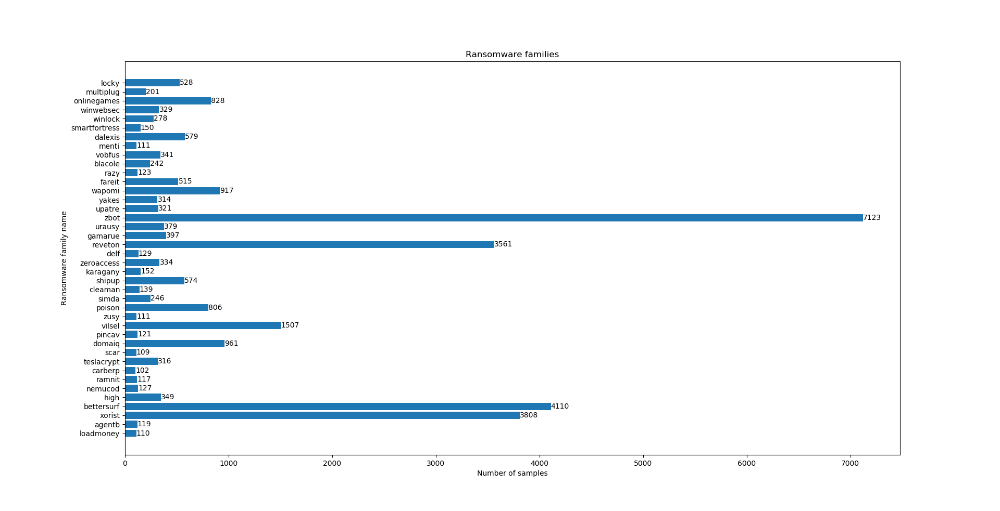

# Malware samples

The ransomware malware set consists of 61.262 samples from June 2012 till February 2019 collected with the help of *VirusShare.com*.
The samples are labeled and grouped with the meta information provided by the academic API of *VirusTotal.com* using the *[AVClass](https://github.com/malicialab/avclass)* malware labeling tool.

We grouped the samples into the following 124 families.


## Samples

Every sample provides all meta information provided by *VirusTotal.com* as json.

```json
{
    "data": {
        "attributes": {
            "type_description": "Win32 EXE",
            "vhash": "015056651d155e7bza1avz45z",
            "exiftool": {
                "SubsystemVersion": "4.0",
                "LinkerVersion": "6.0",
                "ImageVersion": "0.0",
                "ProductName": "tencent QQGameUpdate",
                "FileVersionNumber": "1.0.0.1",
                "UninitializedDataSize": "0",
                "LanguageCode": "Chinese (Simplified)",
                "FileFlagsMask": "0x003f",
                "ImageFileCharacteristics": "No relocs, Executable, No line numbers, No symbols, 32-bit",
                "CharacterSet": "Unicode",
                "InitializedDataSize": "24576",
                "FileTypeExtension": "exe",
                "OriginalFileName": "QQGameUpdate.exe",
                "MIMEType": "application/octet-stream",
                "Subsystem": "Windows GUI",
                "FileVersion": "1, 0, 0, 1",
                "TimeStamp": "2007:06:28 09:52:30+02:00",
                "FileType": "Win32 EXE",
                "PEType": "PE32",
                "InternalName": "QQGameUpdate",
                "ProductVersion": "1, 0, 0, 1",
                "FileDescription": "QQGameUpdate",
                "OSVersion": "4.0",
                "FileOS": "Windows NT 32-bit",
                "LegalCopyright": "Copyright ? 2006",
                "MachineType": "Intel 386 or later, and compatibles",
                "CompanyName": "tencent",
                "CodeSize": "106496",
                "FileSubtype": "0",
                "ProductVersionNumber": "1.0.0.1",
                "EntryPoint": "0xa000",
                "ObjectFileType": "Executable application"
            },
            "trid": [
                {
                    "file_type": "Petite compressed Win32 executable",
                    "probability": 53.8
                },
                {
                    "file_type": "Win64 Executable (generic)",
                    "probability": 20.8
                },
                {
                    "file_type": "Microsoft Visual C++ compiled executable (generic)",
                    "probability": 12.4
                },
                {
                    "file_type": "Win32 Dynamic Link Library (generic)",
                    "probability": 4.9
                },
                {
                    "file_type": "Win32 Executable (generic)",
                    "probability": 3.3
                }
            ],
            "creation_date": 1183017150,
            "names": [
                "QQGameUpdate",
                "QQGameUpdate.exe",
                "3e8ff58bd916c0a6bb86083a566b61be4f0e45ec1aceb211cde19f79c23b9ae0.bin",
                "myfile.exe",
                "VirusShare_00a03d37ba2cbcd9a532ff01d3d5e070",
                "VirusShare_00a03d37ba2cbcd9a532ff01d3d5e070.exe",
                "104.exe",
                "00a03d37ba2cbcd9a532ff01d3d5e070",
                "TfzaJgmV1.wsf",
                "4tPP493hv.xlsx"
            ],
            "signature_info": {
                "product": "tencent QQGameUpdate",
                "description": "QQGameUpdate",
                "file version": "1, 0, 0, 1",
                "original name": "QQGameUpdate.exe",
                "x509": [
                    {
                        "name": "VeriSign Class 3 Code Signing 2004 CA",
                        "algorithm": "sha1RSA",
                        "valid from": "12:00 AM 7/16/2004",
                        "valid to": "11:59 PM 7/15/2014",
                        "serial number": "41 91 A1 5A 39 78 DF CF 49 65 66 38 1D 4C 75 C2",
                        "cert issuer": null,
                        "thumbprint": "197A4AEBDB25F0170079BB8C73CB2D655E0018A4",
                        "valid_usage": "Client Auth, Code Signing"
                    },
                    {
                        "name": "Tencent Technology(Shenzhen) Company Limited",
                        "algorithm": "sha1RSA",
                        "valid from": "12:00 AM 2/26/2007",
                        "valid to": "11:59 PM 2/26/2008",
                        "serial number": "D5 5F 99 5E 6C DA 7E 40 DB 86 29 E5 AF 15 E4 8",
                        "cert issuer": "VeriSign Class 3 Code Signing 2004 CA",
                        "thumbprint": "4AF28382B05EC35DB47B5396E8C2BCD68C5C27F0",
                        "valid_usage": "Code Signing"
                    }
                ],
                "copyright": "Copyright ? 2006",
                "internal name": "QQGameUpdate"
            },
            "last_modification_date": 1553307535,
            "type_tag": "peexe",
            "times_submitted": 10,
            "size": 132096,
            "total_votes": {
                "harmless": 0,
                "malicious": 0
            },
            "authentihash": "ff7399a578db7ac810d338ef34de43963d3c9e2b22570a9703ae1bfcafa216d9",
            "last_submission_date": 1548541592,
            "last_analysis_results": {
                "Bkav": {
                    "category": "malicious",
                    "engine_name": "Bkav",
                    "engine_version": "1.3.0.9899",
                    "result": "W32.StChinCharA.PE",
                    "method": "blacklist",
                    "engine_update": "20190320"
                },
                "K7AntiVirus": {
                    "category": "malicious",
                    "engine_name": "K7AntiVirus",
                    "engine_version": "11.34.30374",
                    "result": "Virus ( 700000081 )",
                    "method": "blacklist",
                    "engine_update": "20190322"
                },
                "TotalDefense": {
                    "category": "malicious",
                    "engine_name": "TotalDefense",
                    "engine_version": "37.1.62.1",
                    "result": "Win32/Wapomi.A",
                    "method": "blacklist",
                    "engine_update": "20190322"
                },
                "MicroWorld-eScan": {
                    "category": "malicious",
                    "engine_name": "MicroWorld-eScan",
                    "engine_version": "14.0.297.0",
                    "result": "Win32.Jadtre.E",
                    "method": "blacklist",
                    "engine_update": "20190322"
                },
                "CMC": {
                    "category": "malicious",
                    "engine_name": "CMC",
                    "engine_version": "1.1.0.977",
                    "result": "Virus.Win32.Qvod!O",
                    "method": "blacklist",
                    "engine_update": "20190321"
                },
                "CAT-QuickHeal": {
                    "category": "malicious",
                    "engine_name": "CAT-QuickHeal",
                    "engine_version": "14.00",
                    "result": "W32.Jadtre.I",
                    "method": "blacklist",
                    "engine_update": "20190322"
                },
                "McAfee": {
                    "category": "malicious",
                    "engine_name": "McAfee",
                    "engine_version": "6.0.6.653",
                    "result": "W32/Fujacks.be",
                    "method": "blacklist",
                    "engine_update": "20190322"
                },
                "Malwarebytes": {
                    "category": "undetected",
                    "engine_name": "Malwarebytes",
                    "engine_version": "2.1.1.1115",
                    "result": null,
                    "method": "blacklist",
                    "engine_update": "20190323"
                },
                "CrowdStrike": {
                    "category": "malicious",
                    "engine_name": "CrowdStrike",
                    "engine_version": "1.0",
                    "result": "win/malicious_confidence_100% (W)",
                    "method": "blacklist",
                    "engine_update": "20190212"
                },
                "Alibaba": {
                    "category": "undetected",
                    "engine_name": "Alibaba",
                    "engine_version": "0.2.0.3",
                    "result": null,
                    "method": "blacklist",
                    "engine_update": "20190306"
                },
                "K7GW": {
                    "category": "malicious",
                    "engine_name": "K7GW",
                    "engine_version": "11.34.30375",
                    "result": "Virus ( 700000081 )",
                    "method": "blacklist",
                    "engine_update": "20190322"
                },
                "Cybereason": {
                    "category": "malicious",
                    "engine_name": "Cybereason",
                    "engine_version": "1.2.27",
                    "result": "malicious.7ba2cb",
                    "method": "blacklist",
                    "engine_update": "20190109"
                },
                "Baidu": {
                    "category": "malicious",
                    "engine_name": "Baidu",
                    "engine_version": "1.0.0.2",
                    "result": "Win32.Virus.Otwycal.b",
                    "method": "blacklist",
                    "engine_update": "20190318"
                },
                "NANO-Antivirus": {
                    "category": "malicious",
                    "engine_name": "NANO-Antivirus",
                    "engine_version": "1.0.134.24576",
                    "result": "Virus.Win32.Qvod.bmnus",
                    "method": "blacklist",
                    "engine_update": "20190322"
                },
                "Cyren": {
                    "category": "malicious",
                    "engine_name": "Cyren",
                    "engine_version": "6.2.0.1",
                    "result": "W32/Jadtre.A",
                    "method": "blacklist",
                    "engine_update": "20190323"
                },
                "SymantecMobileInsight": {
                    "category": "type-unsupported",
                    "engine_name": "SymantecMobileInsight",
                    "engine_version": "2.0",
                    "result": null,
                    "method": "blacklist",
                    "engine_update": "20190220"
                },
                "ESET-NOD32": {
                    "category": "malicious",
                    "engine_name": "ESET-NOD32",
                    "engine_version": "19073",
                    "result": "Win32/AutoRun.NAX",
                    "method": "blacklist",
                    "engine_update": "20190323"
                },
                "Zoner": {
                    "category": "malicious",
                    "engine_name": "Zoner",
                    "engine_version": "1.0",
                    "result": "Virus.Win32.32823",
                    "method": "blacklist",
                    "engine_update": "20190323"
                },
                "TheHacker": {
                    "category": "malicious",
                    "engine_name": "TheHacker",
                    "engine_version": "6.8.0.5.4093",
                    "result": "Trojan/Bototer.gen",
                    "method": "blacklist",
                    "engine_update": "20190322"
                },
                "Avast": {
                    "category": "malicious",
                    "engine_name": "Avast",
                    "engine_version": "18.4.3895.0",
                    "result": "Win32:AutoRun-CTB [Trj]",
                    "method": "blacklist",
                    "engine_update": "20190323"
                },
                "ClamAV": {
                    "category": "malicious",
                    "engine_name": "ClamAV",
                    "engine_version": "0.101.1.0",
                    "result": "Win.Trojan.Wapomi-1",
                    "method": "blacklist",
                    "engine_update": "20190322"
                },
                "Kaspersky": {
                    "category": "malicious",
                    "engine_name": "Kaspersky",
                    "engine_version": "15.0.1.13",
                    "result": "Virus.Win32.Qvod.b",
                    "method": "blacklist",
                    "engine_update": "20190323"
                },
                "BitDefender": {
                    "category": "malicious",
                    "engine_name": "BitDefender",
                    "engine_version": "7.2",
                    "result": "Win32.Jadtre.E",
                    "method": "blacklist",
                    "engine_update": "20190323"
                },
                "Babable": {
                    "category": "undetected",
                    "engine_name": "Babable",
                    "engine_version": "9107201",
                    "result": null,
                    "method": "blacklist",
                    "engine_update": "20180918"
                },
                "ViRobot": {
                    "category": "malicious",
                    "engine_name": "ViRobot",
                    "engine_version": "2014.3.20.0",
                    "result": "Win32.Qvod.C",
                    "method": "blacklist",
                    "engine_update": "20190322"
                },
                "SUPERAntiSpyware": {
                    "category": "undetected",
                    "engine_name": "SUPERAntiSpyware",
                    "engine_version": "5.6.0.1032",
                    "result": null,
                    "method": "blacklist",
                    "engine_update": "20190321"
                },
                "Tencent": {
                    "category": "malicious",
                    "engine_name": "Tencent",
                    "engine_version": "1.0.0.1",
                    "result": "Virus.Win32.Dropper.a",
                    "method": "blacklist",
                    "engine_update": "20190323"
                },
                "Ad-Aware": {
                    "category": "malicious",
                    "engine_name": "Ad-Aware",
                    "engine_version": "3.0.5.370",
                    "result": "Win32.Jadtre.E",
                    "method": "blacklist",
                    "engine_update": "20190323"
                },
                "Trustlook": {
                    "category": "undetected",
                    "engine_name": "Trustlook",
                    "engine_version": "1.0",
                    "result": null,
                    "method": "blacklist",
                    "engine_update": "20190323"
                },
                "Sophos": {
                    "category": "malicious",
                    "engine_name": "Sophos",
                    "engine_version": "4.98.0",
                    "result": "W32/Jadtre-B",
                    "method": "blacklist",
                    "engine_update": "20190322"
                },
                "Comodo": {
                    "category": "malicious",
                    "engine_name": "Comodo",
                    "engine_version": "30609",
                    "result": "Virus.Win32.Qvod.~Gen@2tqxoh",
                    "method": "blacklist",
                    "engine_update": "20190322"
                },
                "F-Secure": {
                    "category": "malicious",
                    "engine_name": "F-Secure",
                    "engine_version": "12.0.86.52",
                    "result": "Malware.W32/Wapomi.J",
                    "method": "blacklist",
                    "engine_update": "20190323"
                },
                "DrWeb": {
                    "category": "malicious",
                    "engine_name": "DrWeb",
                    "engine_version": "7.0.34.11020",
                    "result": "Trojan.DownLoader2.18687",
                    "method": "blacklist",
                    "engine_update": "20190323"
                },
                "Zillya": {
                    "category": "malicious",
                    "engine_name": "Zillya",
                    "engine_version": "2.0.0.3780",
                    "result": "Virus.Qvod.Win32.5",
                    "method": "blacklist",
                    "engine_update": "20190322"
                },
                "Invincea": {
                    "category": "malicious",
                    "engine_name": "Invincea",
                    "engine_version": "6.3.6.26157",
                    "result": "heuristic",
                    "method": "blacklist",
                    "engine_update": "20190313"
                },
                "McAfee-GW-Edition": {
                    "category": "malicious",
                    "engine_name": "McAfee-GW-Edition",
                    "engine_version": "v2017.3010",
                    "result": "BehavesLike.Win32.Ramnit.cc",
                    "method": "blacklist",
                    "engine_update": "20190322"
                },
                "Trapmine": {
                    "category": "malicious",
                    "engine_name": "Trapmine",
                    "engine_version": "3.1.48.748",
                    "result": "malicious.moderate.ml.score",
                    "method": "blacklist",
                    "engine_update": "20190301"
                },
                "Emsisoft": {
                    "category": "malicious",
                    "engine_name": "Emsisoft",
                    "engine_version": "2018.4.0.1029",
                    "result": "Win32.Jadtre.E (B)",
                    "method": "blacklist",
                    "engine_update": "20190323"
                },
                "SentinelOne": {
                    "category": "malicious",
                    "engine_name": "SentinelOne",
                    "engine_version": "1.0.24.302",
                    "result": "DFI - Malicious PE",
                    "method": "blacklist",
                    "engine_update": "20190317"
                },
                "GData": {
                    "category": "malicious",
                    "engine_name": "GData",
                    "engine_version": "A:25.21224B:25.14667",
                    "result": "Win32.Jadtre.E",
                    "method": "blacklist",
                    "engine_update": "20190322"
                },
                "Endgame": {
                    "category": "malicious",
                    "engine_name": "Endgame",
                    "engine_version": "3.0.8",
                    "result": "malicious (high confidence)",
                    "method": "blacklist",
                    "engine_update": "20190322"
                },
                "Avira": {
                    "category": "malicious",
                    "engine_name": "Avira",
                    "engine_version": "8.3.3.8",
                    "result": "W32/Wapomi.J",
                    "method": "blacklist",
                    "engine_update": "20190322"
                },
                "Antiy-AVL": {
                    "category": "malicious",
                    "engine_name": "Antiy-AVL",
                    "engine_version": "3.0.0.1",
                    "result": "Virus/Win32.Qvod.b",
                    "method": "blacklist",
                    "engine_update": "20190323"
                },
                "Kingsoft": {
                    "category": "malicious",
                    "engine_name": "Kingsoft",
                    "engine_version": "2013.8.14.323",
                    "result": "Win32.Agent.g.421888",
                    "method": "blacklist",
                    "engine_update": "20190323"
                },
                "Microsoft": {
                    "category": "malicious",
                    "engine_name": "Microsoft",
                    "engine_version": "1.1.15800.1",
                    "result": "Virus:Win32/Jadtre.I",
                    "method": "blacklist",
                    "engine_update": "20190323"
                },
                "Jiangmin": {
                    "category": "malicious",
                    "engine_name": "Jiangmin",
                    "engine_version": "16.0.100",
                    "result": "Win32/Agent.q",
                    "method": "blacklist",
                    "engine_update": "20190323"
                },
                "Arcabit": {
                    "category": "malicious",
                    "engine_name": "Arcabit",
                    "engine_version": "1.0.0.844",
                    "result": "Win32.Jadtre.E",
                    "method": "blacklist",
                    "engine_update": "20190322"
                },
                "AegisLab": {
                    "category": "malicious",
                    "engine_name": "AegisLab",
                    "engine_version": "4.2",
                    "result": "Virus.Win32.Qvod.n!c",
                    "method": "blacklist",
                    "engine_update": "20190323"
                },
                "ZoneAlarm": {
                    "category": "malicious",
                    "engine_name": "ZoneAlarm",
                    "engine_version": "1.0",
                    "result": "Virus.Win32.Qvod.b",
                    "method": "blacklist",
                    "engine_update": "20190323"
                },
                "Avast-Mobile": {
                    "category": "undetected",
                    "engine_name": "Avast-Mobile",
                    "engine_version": "190322-00",
                    "result": null,
                    "method": "blacklist",
                    "engine_update": "20190322"
                },
                "TACHYON": {
                    "category": "undetected",
                    "engine_name": "TACHYON",
                    "engine_version": "2019-03-23.01",
                    "result": null,
                    "method": "blacklist",
                    "engine_update": "20190323"
                },
                "AhnLab-V3": {
                    "category": "malicious",
                    "engine_name": "AhnLab-V3",
                    "engine_version": "3.15.0.23609",
                    "result": "Win32/Dellboy.BG",
                    "method": "blacklist",
                    "engine_update": "20190322"
                },
                "Acronis": {
                    "category": "malicious",
                    "engine_name": "Acronis",
                    "engine_version": "1.0.1.40",
                    "result": "suspicious",
                    "method": "blacklist",
                    "engine_update": "20190322"
                },
                "VBA32": {
                    "category": "malicious",
                    "engine_name": "VBA32",
                    "engine_version": "4.0.0",
                    "result": "Virus.Win32.Qvod.b",
                    "method": "blacklist",
                    "engine_update": "20190322"
                },
                "MAX": {
                    "category": "malicious",
                    "engine_name": "MAX",
                    "engine_version": "2018.9.12.1",
                    "result": "malware (ai score=100)",
                    "method": "blacklist",
                    "engine_update": "20190323"
                },
                "Panda": {
                    "category": "malicious",
                    "engine_name": "Panda",
                    "engine_version": "4.6.4.2",
                    "result": "W32/Bototer.D",
                    "method": "blacklist",
                    "engine_update": "20190322"
                },
                "TrendMicro-HouseCall": {
                    "category": "malicious",
                    "engine_name": "TrendMicro-HouseCall",
                    "engine_version": "10.0.0.1040",
                    "result": "PE_PIKOR.A",
                    "method": "blacklist",
                    "engine_update": "20190322"
                },
                "Rising": {
                    "category": "malicious",
                    "engine_name": "Rising",
                    "engine_version": "25.0.0.24",
                    "result": "Win32.Fednu.e (CLOUD)",
                    "method": "blacklist",
                    "engine_update": "20190322"
                },
                "Yandex": {
                    "category": "malicious",
                    "engine_name": "Yandex",
                    "engine_version": "5.5.1.3",
                    "result": "Win32.Jadtre.Gen",
                    "method": "blacklist",
                    "engine_update": "20190321"
                },
                "Ikarus": {
                    "category": "malicious",
                    "engine_name": "Ikarus",
                    "engine_version": "0.1.5.2",
                    "result": "Worm.Win32.Pikorms",
                    "method": "blacklist",
                    "engine_update": "20190322"
                },
                "eGambit": {
                    "category": "malicious",
                    "engine_name": "eGambit",
                    "engine_version": "v4.3.6",
                    "result": "PE.Heur.InvalidSig",
                    "method": "blacklist",
                    "engine_update": "20190323"
                },
                "Fortinet": {
                    "category": "malicious",
                    "engine_name": "Fortinet",
                    "engine_version": "5.4.247.0",
                    "result": "W32/Krypt.C!tr.bdr",
                    "method": "blacklist",
                    "engine_update": "20190323"
                },
                "AVG": {
                    "category": "malicious",
                    "engine_name": "AVG",
                    "engine_version": "18.4.3895.0",
                    "result": "Win32:AutoRun-CTB [Trj]",
                    "method": "blacklist",
                    "engine_update": "20190323"
                },
                "Paloalto": {
                    "category": "malicious",
                    "engine_name": "Paloalto",
                    "engine_version": "1.0",
                    "result": "generic.ml",
                    "method": "blacklist",
                    "engine_update": "20190323"
                },
                "Qihoo-360": {
                    "category": "malicious",
                    "engine_name": "Qihoo-360",
                    "engine_version": "1.0.0.1120",
                    "result": "Virus.Win32.Downloader.AF",
                    "method": "blacklist",
                    "engine_update": "20190323"
                }
            },
            "sha256": "3e8ff58bd916c0a6bb86083a566b61be4f0e45ec1aceb211cde19f79c23b9ae0",
            "tags": [
                "peexe"
            ],
            "last_analysis_date": 1553307366,
            "behaviour": {
                "hooking": [],
                "network": {
                    "udp": [],
                    "http": [],
                    "tcp": [],
                    "dns": []
                },
                "service": {
                    "controlled": [],
                    "opened": [],
                    "created": [],
                    "deleted": [],
                    "opened-managers": [],
                    "started": []
                },
                "extra": [],
                "process": {
                    "injected": [],
                    "shellcmds": [],
                    "tree": [
                        {
                            "pid": 576,
                            "children": [],
                            "name": "3e8ff58bd916c0a6bb86083a566b61be4f0e45ec1aceb211cde19f79c23b9ae0"
                        }
                    ],
                    "terminated": [],
                    "created": [
                        {
                            "proc": "C:\\07cc58f5.exe",
                            "success": true
                        }
                    ]
                },
                "hosts_file": null,
                "windows": {
                    "searched": []
                },
                "runtime-dlls": [
                    {
                        "success": true,
                        "file": "advapi32.dll"
                    },
                    {
                        "success": false,
                        "file": "factory.dll"
                    }
                ],
                "version": "windows-v1",
                "mutex": {
                    "opened": [
                        {
                            "mutex": "ShimCacheMutex",
                            "success": true
                        }
                    ],
                    "created": []
                },
                "registry": {
                    "deleted": [],
                    "set": []
                },
                "filesystem": {
                    "opened": [
                        {
                            "path": "C:\\07cc58f5.exe",
                            "success": true
                        }
                    ],
                    "deleted": [],
                    "moved": [],
                    "downloaded": [],
                    "written": [
                        {
                            "path": "C:\\07cc58f5.exe",
                            "success": true
                        }
                    ],
                    "read": [],
                    "replaced": [],
                    "copied": []
                }
            },
            "first_submission_date": 1400918021,
            "sha1": "3f8b7ed71ec97f4f7d6141249e71b280f2bcd803",
            "ssdeep": "3072:uTIjzH9DNAKBC5CH+xfpTu0w95YeoLoSqtIz1/c:u0jz5jBC564BQbYe5td",
            "md5": "00a03d37ba2cbcd9a532ff01d3d5e070",
            "unique_sources": 7,
            "pe_info": {
                "resource_details": [
                    {
                        "lang": "CHINESE SIMPLIFIED",
                        "chi2": 76918.953125,
                        "filetype": "data",
                        "entropy": 2.423861026763916,
                        "sha256": "5d735b251d5f43b07146ac4c5896d012d85ac0884fb7b1481346ed890d70ea1b",
                        "type": "RT_ICON"
                    },
                    {
                        "lang": "CHINESE SIMPLIFIED",
                        "chi2": 121062.4296875,
                        "filetype": "data",
                        "entropy": 5.622669696807861,
                        "sha256": "ef07aec9607680b664a9763fa5ff86d75344e64c8f5ededc61fd2378ab6a1db9",
                        "type": "RT_ICON"
                    },
                    {
                        "lang": "CHINESE SIMPLIFIED",
                        "chi2": 59284.2109375,
                        "filetype": "data",
                        "entropy": 6.054128646850586,
                        "sha256": "77df92966d5cad229cbe2b6ab31a19b26d730aa978335b2157b08f8deca27fb3",
                        "type": "RT_ICON"
                    },
                    {
                        "lang": "CHINESE SIMPLIFIED",
                        "chi2": 98235.8515625,
                        "filetype": "data",
                        "entropy": 4.572564601898193,
                        "sha256": "3a2ac87d43362258b2b8844a6e8b1e12ad1e55e0b2697ce8e7c3eaf2a93d7ace",
                        "type": "RT_ICON"
                    },
                    {
                        "lang": "CHINESE SIMPLIFIED",
                        "chi2": 320370.96875,
                        "filetype": "data",
                        "entropy": 5.221005439758301,
                        "sha256": "8acc0e84c5f8b7c5f3604fe0e1c1ca057423935f5073ba3e4267ff508c177698",
                        "type": "RT_ICON"
                    },
                    {
                        "lang": "CHINESE SIMPLIFIED",
                        "chi2": 94425.671875,
                        "filetype": "data",
                        "entropy": 5.919209003448486,
                        "sha256": "59b6ac9d748b79d7fa5086353d209bb995ea6615f11c1f95029e73b31f78bfbc",
                        "type": "RT_ICON"
                    },
                    {
                        "lang": "CHINESE SIMPLIFIED",
                        "chi2": 23369.859375,
                        "filetype": "data",
                        "entropy": 5.950766563415527,
                        "sha256": "e573395a81e51712534eaa51e8ab6aeae57df4ed697c78886ad5cce141b15f94",
                        "type": "RT_ICON"
                    },
                    {
                        "lang": "CHINESE SIMPLIFIED",
                        "chi2": 18808.865234375,
                        "filetype": "data",
                        "entropy": 3.539567708969116,
                        "sha256": "18175c0994683b055fea0773f0e60df40432c510cda82961af678c65ac0a5acf",
                        "type": "RT_ICON"
                    },
                    {
                        "lang": "CHINESE SIMPLIFIED",
                        "chi2": 7137.84619140625,
                        "filetype": "data",
                        "entropy": 2.9026684761047363,
                        "sha256": "b501d38a9509161bcd6df748c13638677a13340ec8d98e705f0c4b244a8eb8c8",
                        "type": "RT_GROUP_ICON"
                    },
                    {
                        "lang": "CHINESE SIMPLIFIED",
                        "chi2": 1567.2001953125,
                        "filetype": "data",
                        "entropy": 2.160964012145996,
                        "sha256": "a0c9d012e2bf6b2fe05c2d97cb5594d97cf2f539e97935c12abd7a3562f4d9bf",
                        "type": "RT_GROUP_ICON"
                    },
                    {
                        "lang": "CHINESE SIMPLIFIED",
                        "chi2": 71406.21875,
                        "filetype": "data",
                        "entropy": 3.3291187286376953,
                        "sha256": "243edad7bb6c15140805d44959796cb8cd3f0027bf19e97e91f66c69488a24b1",
                        "type": "RT_VERSION"
                    }
                ],
                "resource_types": {
                    "RT_ICON": 8,
                    "RT_VERSION": 1,
                    "RT_GROUP_ICON": 2
                },
                "timestamp": 1183017150,
                "imphash": "985d38512cb5433fc84c4c558ffe100c",
                "resource_langs": {
                    "CHINESE SIMPLIFIED": 11
                },
                "machine_type": 332,
                "imports": {
                    "MSVCP60.dll": [
                        "?assign@?$basic_string@DU?$char_traits@D@std@@V?$allocator@D@2@@std@@QAEAAV12@PBDI@Z",
                        "?_C@?1??_Nullstr@?$basic_string@DU?$char_traits@D@std@@V?$allocator@D@2@@std@@CAPBDXZ@4DB",
                        "??1?$basic_string@DU?$char_traits@D@std@@V?$allocator@D@2@@std@@QAE@XZ",
                        "?_Tidy@?$basic_string@DU?$char_traits@D@std@@V?$allocator@D@2@@std@@AAEX_N@Z"
                    ],
                    "KERNEL32.dll": [
                        "GetStartupInfoA",
                        "GetModuleFileNameA",
                        "GetPrivateProfileStringA",
                        "GetModuleHandleA",
                        "GetPrivateProfileIntA",
                        "CreateDirectoryA",
                        "FreeLibrary",
                        "CopyFileA",
                        "GetProcAddress",
                        "LoadLibraryA"
                    ],
                    "MSVCRT.dll": [
                        "_purecall",
                        "__p__fmode",
                        "_mbsnbcpy",
                        "_acmdln",
                        "_controlfp",
                        "_access",
                        "strlen",
                        "_except_handler3",
                        "_mbsrchr",
                        "??2@YAPAXI@Z",
                        "_snprintf",
                        "_XcptFilter",
                        "exit",
                        "__setusermatherr",
                        "__p__commode",
                        "__CxxFrameHandler",
                        "_exit",
                        "_adjust_fdiv",
                        "free",
                        "_mbschr",
                        "__getmainargs",
                        "memcpy",
                        "_vsnprintf",
                        "strcpy",
                        "_initterm",
                        "__set_app_type"
                    ]
                },
                "entry_point": 40960,
                "sections": [
                    {
                        "name": ".text",
                        "virtual_address": 4096,
                        "entropy": 6.07,
                        "raw_size": 4096,
                        "virtual_size": 3866,
                        "md5": "0c942db057a3277cde438611bfb657d3"
                    },
                    {
                        "name": ".rdata",
                        "virtual_address": 8192,
                        "entropy": 4.23,
                        "raw_size": 2048,
                        "virtual_size": 1622,
                        "md5": "4ef71f38f0a6609c658fb4df365c5d93"
                    },
                    {
                        "name": ".data",
                        "virtual_address": 12288,
                        "entropy": 3.08,
                        "raw_size": 512,
                        "virtual_size": 836,
                        "md5": "90b3c320e80daed95fff4b1711779b40"
                    },
                    {
                        "name": ".rsrc",
                        "virtual_address": 16384,
                        "entropy": 5.45,
                        "raw_size": 21504,
                        "virtual_size": 21456,
                        "md5": "8ebf9fda7aada632cb61d59464218b97"
                    },
                    {
                        "name": "X",
                        "virtual_address": 40960,
                        "entropy": 7.61,
                        "raw_size": 99328,
                        "virtual_size": 102400,
                        "md5": "3b45df0ce085f9c32cbf58284b41155a"
                    }
                ]
            },
            "magic": "PE32 executable for MS Windows (GUI) Intel 80386 32-bit",
            "last_analysis_stats": {
                "suspicious": 0,
                "harmless": 0,
                "malicious": 57,
                "undetected": 7,
                "failure": 0,
                "type-unsupported": 1,
                "timeout": 0
            },
            "meaningful_name": "QQGameUpdate.exe",
            "reputation": 0
        },
        "type": "file",
        "id": "3e8ff58bd916c0a6bb86083a566b61be4f0e45ec1aceb211cde19f79c23b9ae0",
        "links": {
            "self": "https://www.virustotal.com/api/v3/files/3e8ff58bd916c0a6bb86083a566b61be4f0e45ec1aceb211cde19f79c23b9ae0"
        }
    }
}
```